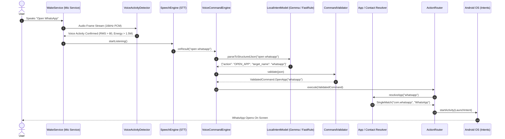

# Atmini Comprehensive Codebase & Architecture Guide

Welcome to the definitive, complete architecture and codebase guide for **Atmini**. This document is designed so that any developer can instantly understand what every file and subsystem does, where logic resides, and how to safely extend, modify, or debug the application.

---

## 1. Executive Summary & Philosophy

**Atmini** is an offline, privacy-first local voice command & cognitive reflex engine for Android. Rather than delegating critical system actions directly to an unconstrained probabilistic model, Atmini treats on-device AI as a **Semantic Intent Compiler**:

$$\text{Voice/Audio} \longrightarrow \text{VAD \& Stream} \longrightarrow \text{Offline STT} \longrightarrow \text{Semantic Compiler (Gemma/SLM)} \longrightarrow \text{Deterministic Validator} \longrightarrow \text{Resolvers \& Policies} \longrightarrow \text{Android System Execution}$$

1. **Deterministic Safety**: Actions like phone calls, alarms, reminders, app launches, and map routing are validated and routed through Kotlin business logic and permission-checked intent policies.
2. **True Offline Capability**: Designed to function with zero external network connectivity using on-device STT (`SpeechRecognizer.createOnDeviceSpeechRecognizer`), fast-path rule compilers, and local Gemma adapters.
3. **Power Efficiency**: Employs an ultra-low-power Voice Activity Detector (VAD), frame decimation, and background foreground-service lifecycle management.

---

## 2. Complete Project Directory Structure ("What Is Where")

```
C:/Android/Atmini/
├── app/
│   ├── build.gradle.kts                          # Module-level Gradle configuration
│   └── src/main/
│       ├── AndroidManifest.xml                   # Permissions, receivers, activities & services
│       ├── assets/
│       │   └── core/l0/memory/
│       │       └── wake_signature.json           # Default reference acoustic patterns
│       ├── java/com/pranav/atmini/
│       │   ├── MainActivity.kt                   # Primary UI activity & permission coordinator
│       │   ├── AtminiVoiceService.kt             # Service entry point for intent text payloads
│       │   │
│       │   ├── core/                             # Core Execution & Reasoning Engine
│       │   │   ├── VoiceCommandEngine.kt         # Master Orchestrator (STT -> AI -> Validator -> Router)
│       │   │   │
│       │   │   ├── l0/                           # L0 Reflex & Semantic Subsystems
│       │   │   │   ├── AtminiAction.kt           # Legacy L0 sealed action definitions
│       │   │   │   ├── AtminiBrain.kt            # Dispatch gateway to legacy command registry
│       │   │   │   ├── L0ReflexSystem.kt         # Direct intent execution for L0 actions
│       │   │   │   ├── ReflexResult.kt           # Execution result value object
│       │   │   │   │
│       │   │   │   ├── ai/                       # Semantic AI & SLM Compilers
│       │   │   │   │   └── LocalIntentModel.kt   # GemmaIntentModel & FastRuleIntentModel
│       │   │   │   │
│       │   │   │   ├── model/                    # Domain Command Models
│       │   │   │   │   └── CommandModels.kt      # ActionType, RawParsedCommand, ValidatedCommand, etc.
│       │   │   │   │
│       │   │   │   ├── resolver/                 # Deterministic Entity Resolution
│       │   │   │   │   ├── AppResolver.kt        # Levenshtein matcher with ambiguity delta
│       │   │   │   │   └── ContactResolver.kt    # System contacts resolver with score thresholding
│       │   │   │   │
│       │   │   │   ├── router/                   # Policy Engine & System Intent Execution
│       │   │   │   │   └── ActionRouter.kt       # PolicyEngine & system action handlers
│       │   │   │   │
│       │   │   │   ├── validation/               # Validation & Semantic Time Resolution
│       │   │   │   │   └── CommandValidator.kt   # JSON cleaner, schema validator, LocalTime/LocalDateTime parser
│       │   │   │   │
│       │   │   │   └── command/                  # Keyword Parser & Plugin Architecture
│       │   │   │       ├── AiCommandInterpreter.kt
│       │   │   │       ├── AtminiCommand.kt
│       │   │   │       ├── CommandPlugin.kt
│       │   │   │       ├── CommandRegistry.kt
│       │   │   │       └── plugins/
│       │   │   │           ├── AiCommandPlugin.kt
│       │   │   │           └── MapsCommandPlugin.kt
│       │   │   │
│       │   │   └── service/
│       │   │       └── AtminiBaseService.kt      # Abstract service base template
│       │   │
│       │   ├── feature/                          # Feature Modules
│       │   │   ├── app/                          # Installed App Discovery & Matching
│       │   │   │   ├── AppDiscovery.kt           # Launcher queries via PackageManager
│       │   │   │   ├── AppMatcher.kt             # Fuzzy & exact string app matcher
│       │   │   │   └── InstalledApp.kt           # App metadata data class
│       │   │   │
│       │   │   ├── home/                         # Presentation Layer (Jetpack Compose)
│       │   │   │   ├── ActionUiMapper.kt         # Maps execution results to UI status text
│       │   │   │   ├── AssistantStatus.kt        # Idle, Listening, Thinking, Acting states
│       │   │   │   ├── HomeScreen.kt             # Material3 Compose dashboard & user guide
│       │   │   │   └── HomeViewModel.kt          # Flow state management & voice pipeline trigger
│       │   │   │
│       │   │   └── voice/                        # Acoustic & Speech Pipeline
│       │   │       ├── VoiceManager.kt           # SpeechRecognizer intent overlay launcher
│       │   │       │
│       │   │       ├── speech/                   # Speech-To-Text Recognition
│       │   │       │   ├── SpeechEngine.kt       # Continuous SpeechRecognizer engine
│       │   │       │   └── SttEngine.kt          # SttEngine interface & on-device factory
│       │   │       │
│       │   │       └── wake/                     # Continuous On-Device Acoustic Wake Subsystem
│       │   │           ├── AudioCapture.kt       # Non-blocking 16kHz PCM AudioRecord stream
│       │   │           ├── BootReceiver.kt       # BOOT_COMPLETED broadcast receiver
│       │   │           ├── EnergyVariationDetector.kt # Inter-frame energy delta calculator
│       │   │           ├── FeatureExtractor.kt   # Energy, ZCR & Delta feature extraction
│       │   │           ├── SpeechWindowTracker.kt# Stable voice frame tracker
│       │   │           ├── TransientNoiseDetector.kt # Zero-allocation impulse noise detector
│       │   │           ├── VoiceActivityDetector.kt  # Multi-factor low-power VAD (RMS, Energy, ZCR)
│       │   │           ├── WakeAudioFrame.kt     # PCM sample container with timestamp
│       │   │           ├── WakeBuffer.kt         # Sliding window ring/deque buffer
│       │   │           ├── WakeEnrollmentController.kt # Acoustic training controller
│       │   │           ├── WakeEvent.kt          # Wake event payload
│       │   │           ├── WakeEventEmitter.kt   # Conditional wake trigger emitter
│       │   │           ├── WakeFeatures.kt       # Extracted audio features data class
│       │   │           ├── WakeGate.kt           # Cooldown throttle gate
│       │   │           ├── WakeMatcher.kt        # Sliding cosine similarity & normalized matcher
│       │   │           ├── WakePhraseBuffer.kt   # Continuous speech segmenting buffer
│       │   │           ├── WakeService.kt        # Microphone Foreground Service
│       │   │           ├── WakeSignature.kt      # Acoustic reference model
│       │   │           ├── WakeSignatureStore.kt # JSON persistence store
│       │   │           └── ZeroCrossingDetector.kt # Zero-crossing frequency estimator
│       │   │
│       │   ├── ui/theme/                         # Design System
│       │   │   ├── Color.kt                      # Color palette
│       │   │   ├── Theme.kt                      # Material3 theme definition
│       │   │   └── Type.kt                       # Typography
│       │   │
│       │   └── util/
│       │       ├── Extensions.kt                 # Kotlin utility extensions
│       │       └── PermissionHelper.kt           # Permission checking helper
│       │
│       └── res/                                  # Android Resources (Drawables, Mipmaps, Values, Themes)
│
├── Help/                                         # Deep Theory & High-Level Architecture Specifications
│   ├── Architecture.md                           # Master 6-Layer Cognitive Organism Architecture
│   ├── ArchitectureV2.md                         # Formal cognitive models & state transitions
│   ├── ArchitectureV3.md                         # Memory taxonomy, dream cycles & governance
│   ├── ArchitectureV4.md                         # Advanced symbolic & temporal coordination
│   ├── Architecture_Extended.md                  # Extended domain notes
│   └── Architecture_missouts.md                  # Gap analysis and implementation roadmap
│
├── Plan.md                                       # Local Voice Assistant Implementation Plan
├── README.md                                     # Project Introduction & Overview
└── PROJECT_DOCUMENTATION.md                      # (This File) Current Codebase Map
```

---

## 3. Subsystem Breakdown & Component Responsibilities

### 3.1 Master Orchestration (`com.pranav.atmini.core`)
* **[`VoiceCommandEngine.kt`](file:///C:/Android/Atmini/app/src/main/java/com/pranav/atmini/core/VoiceCommandEngine.kt)**: The central controller connecting all decoupled subsystems.
  - `onWakeWordTriggered(onStatusUpdate)`: Invokes `SttEngine` to capture user speech.
  - `processTranscript(transcript, onStatusUpdate)`: Runs transcript through `LocalIntentModel` $\rightarrow$ `CommandValidator` $\rightarrow$ `ActionRouter`.
  - `confirmAndExecute(command)`: Bypasses policy confirmation for user-approved sensitive actions (such as placing phone calls).

### 3.2 Semantic AI & Intent Compilation (`com.pranav.atmini.core.l0.ai`)
* **[`LocalIntentModel.kt`](file:///C:/Android/Atmini/app/src/main/java/com/pranav/atmini/core/l0/ai/LocalIntentModel.kt)**:
  - `GemmaIntentModel`: Implements prompt-constrained JSON compilation targeting Gemma 3 270M / 370M on-device inference formats.
  - `FastRuleIntentModel`: Instant offline deterministic rule-based compiler matching regex patterns and token keywords with zero runtime latency.

### 3.3 Data Models & Validation (`com.pranav.atmini.core.l0.model` & `validation`)
* **[`CommandModels.kt`](file:///C:/Android/Atmini/app/src/main/java/com/pranav/atmini/core/l0/model/CommandModels.kt)**:
  - `ActionType`: `OPEN_APP`, `CALL_CONTACT`, `NAVIGATE`, `SET_TIMER`, `SET_ALARM`, `SET_REMINDER`, `UNKNOWN`.
  - `RawParsedCommand`: Intermediate JSON format output by the SLM.
  - `ValidatedCommand`: Strongly-typed command representations (`OpenApp`, `CallContact`, `Navigate`, `SetTimer`, `SetAlarm`, `SetReminder`, `Invalid`).
  - `ResolutionResult<T>`: Represents `SingleMatch`, `Ambiguous`, or `NoMatch`.
  - `ExecutionResult`: Encapsulates `Success`, `NeedsConfirmation`, `NeedsClarification`, and `Failure`.
* **[`CommandValidator.kt`](file:///C:/Android/Atmini/app/src/main/java/com/pranav/atmini/core/l0/validation/CommandValidator.kt)**:
  - Sanitizes raw JSON, stripping non-JSON markdown wrapper blocks.
  - Resolves semantic time expressions (`"HH:mm"`, `day_offset`, `relative_delay_seconds`) into precise system `LocalTime` and `LocalDateTime` instances.

### 3.4 Entity Resolution & Policy Execution (`com.pranav.atmini.core.l0.resolver` & `router`)
* **[`AppResolver.kt`](file:///C:/Android/Atmini/app/src/main/java/com/pranav/atmini/core/l0/resolver/AppResolver.kt)**:
  - Queries `PackageManager` for installed launcher applications.
  - Computes Levenshtein edit distance similarity. If top two matches differ by less than `0.12`, returns `ResolutionResult.Ambiguous` to request user disambiguation.
* **[`ContactResolver.kt`](file:///C:/Android/Atmini/app/src/main/java/com/pranav/atmini/core/l0/resolver/ContactResolver.kt)**:
  - Queries `ContactsContract.CommonDataKinds.Phone` for names and phone numbers.
  - Uses Jaro/substring scoring and enforces an ambiguity delta check (`0.15`).
* **[`ActionRouter.kt`](file:///C:/Android/Atmini/app/src/main/java/com/pranav/atmini/core/l0/router/ActionRouter.kt)**:
  - `PolicyEngine`: Defines whether an action requires explicit user confirmation (`CALL_CONTACT` requires confirmation).
  - `ActionRouter`: Dispatches target Android system intents (`Intent.FLAG_ACTIVITY_NEW_TASK`, `ACTION_CALL`/`ACTION_DIAL`, `AlarmClock.ACTION_SET_TIMER`, `AlarmClock.ACTION_SET_ALARM`, `CalendarContract.Events`, Google Maps navigation `google.navigation:q=`).

### 3.5 Voice Wake & Speech Subsystems (`feature.voice.wake` & `feature.voice.speech`)
* **[`WakeService.kt`](file:///C:/Android/Atmini/app/src/main/java/com/pranav/atmini/feature/voice/wake/WakeService.kt)**:
  - Android Foreground Service with microphone type (`foregroundServiceType="microphone"`).
  - Coordinates `AudioCapture` (16kHz PCM mono), low-power `VoiceActivityDetector` (RMS + Energy + ZCR thresholding), `SpeechWindowTracker`, and `WakeGate` cooldown.
  - Automatically activates `SpeechEngine` upon detected voice activity.
* **[`SpeechEngine.kt`](file:///C:/Android/Atmini/app/src/main/java/com/pranav/atmini/feature/voice/speech/SpeechEngine.kt)**:
  - Wrapper over Android's native `SpeechRecognizer` streaming recognized words and dispatching completed transcripts.
* **[`SttEngine.kt`](file:///C:/Android/Atmini/app/src/main/java/com/pranav/atmini/feature/voice/speech/SttEngine.kt)**:
  - Offline-first speech recognition abstraction featuring API 31+ `createOnDeviceSpeechRecognizer` (`EXTRA_PREFER_OFFLINE = true`) and `LocalWhisperSttEngine` fallback stub.

### 3.6 Presentation & UI (`feature.home` & `MainActivity`)
* **[`MainActivity.kt`](file:///C:/Android/Atmini/app/src/main/java/com/pranav/atmini/MainActivity.kt)**:
  - Entry point managing runtime permissions (`RECORD_AUDIO`, `READ_CONTACTS`, `CALL_PHONE`), foreground service initialization, and hosting the Compose view.
* **[`HomeScreen.kt`](file:///C:/Android/Atmini/app/src/main/java/com/pranav/atmini/feature/home/HomeScreen.kt)**:
  - Material3 Compose landing screen displaying live state indicators (`🟢 Idle`, `🎤 Listening...`, `🧠 Thinking...`, `⚙️ Acting...`), real-time transcripts, execution results, and user setup guides.
* **[`HomeViewModel.kt`](file:///C:/Android/Atmini/app/src/main/java/com/pranav/atmini/feature/home/HomeViewModel.kt)**:
  - Manages reactive state flow (`HomeState`) and interfaces directly with `VoiceCommandEngine`.

---

## 4. End-to-End Execution Sequence



---

## 5. Developer Guide: Making Safe Code Modifications

### 5.1 Adding a New Voice Command Action
1. **Model Definition**: Add a new action in [`CommandModels.kt`](file:///C:/Android/Atmini/app/src/main/java/com/pranav/atmini/core/l0/model/CommandModels.kt):
   - Add enum value in `ActionType` (e.g. `SEND_MESSAGE`).
   - Add data class in `ValidatedCommand` (e.g. `data class SendMessage(val recipient: String, val body: String) : ValidatedCommand()`).
2. **Intent Parsing**: Update [`LocalIntentModel.kt`](file:///C:/Android/Atmini/app/src/main/java/com/pranav/atmini/core/l0/ai/LocalIntentModel.kt):
   - Add action to `buildConstrainedPrompt()` schema.
   - Add parsing branch in `FastRuleIntentModel.parseToStructuredJsonSync()`.
3. **Validation**: Update [`CommandValidator.kt`](file:///C:/Android/Atmini/app/src/main/java/com/pranav/atmini/core/l0/validation/CommandValidator.kt):
   - Map `ActionType.SEND_MESSAGE` to construct `ValidatedCommand.SendMessage`.
4. **Execution Router**: Update [`ActionRouter.kt`](file:///C:/Android/Atmini/app/src/main/java/com/pranav/atmini/core/l0/router/ActionRouter.kt):
   - Implement handler `handleSendMessage(...)` creating target `Intent.ACTION_SENDTO`.

### 5.2 Adjusting Voice Sensitivity & Noise Immunity
* Open [`VoiceActivityDetector.kt`](file:///C:/Android/Atmini/app/src/main/java/com/pranav/atmini/feature/voice/wake/VoiceActivityDetector.kt):
  - `threshold`: Set minimum energy required for speech (default `1500000`). Raise if room noise triggers false activations; lower if soft speech is ignored.
  - `zcrThreshold`: Set minimum zero-crossing rate (default `220`).
* Open [`SpeechWindowTracker.kt`](file:///C:/Android/Atmini/app/src/main/java/com/pranav/atmini/feature/voice/wake/SpeechWindowTracker.kt):
  - `requiredFrames`: Number of continuous speech frames before triggering (default `8` frames $\approx$ 800ms).

### 5.3 Verifying Project Builds
Always run the following Gradle task before committing changes:
```powershell
./gradlew app:assembleDebug
```
Ensure build finishes with status: `BUILD SUCCESSFUL`.
